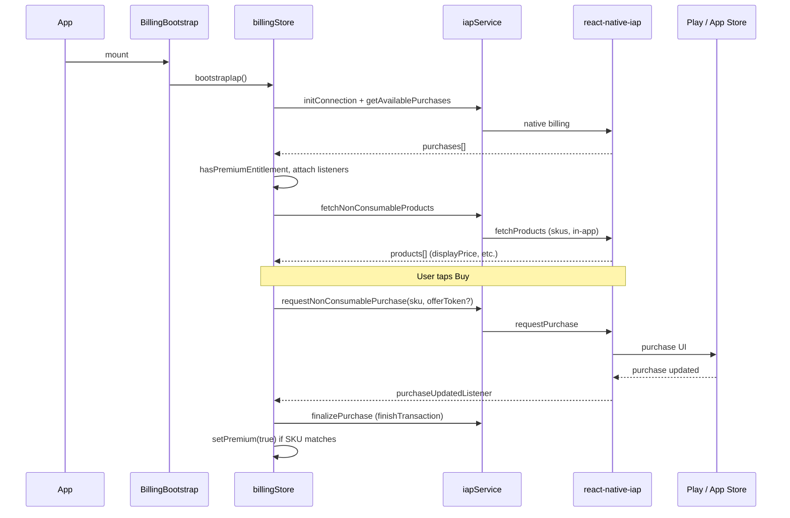

# In-app purchases — CiclePark

Technical and product reference for **Google Play Billing** and **Apple In-App Purchase** in this repo. The app sells a **single non-consumable** product framed as a **supporter unlock** (tip / backing the project), not a subscription.

For Play Console upload, tracks, and AAB vs IAP setup, see the Cursor skill [google-play-release](../.cursor/skills/google-play-release/SKILL.md) (path: `.cursor/skills/google-play-release/SKILL.md`).

---

## 1. Product definition

| Field | Value |
|--------|--------|
| **Type** | Non-consumable in-app product (`type: 'in-app'` in code). |
| **Product ID (stores + code)** | `ciclepark_supporter_unlock` |
| **Code constants** | `src/constants/iap.ts` → `IAP_PRODUCT_IDS.supporterUnlock`, `IAP_NON_CONSUMABLE_SKUS` |

**Play Console:** create an **in-app product** (managed / one-time), **not** a subscription, unless you change the stack to `subs` (see §8).

**App Store Connect:** non-consumable in-app purchase with the **same** product identifier.

> **Entitlement model:** The app treats ownership of this SKU as **`isPremium`** in UI copy (e.g. “supporter”, “premium active”). There is **no** server-side receipt validation; trust is **on-device** via store APIs + local persistence (§6).

---

## 2. Dependencies and native configuration

| Piece | Location / note |
|--------|------------------|
| Library | `react-native-iap` (`package.json`). |
| Expo config plugin | `app.json` → `"react-native-iap/plugin"`. |
| Android permission | `app.json` → `android.permissions` includes `com.android.vending.BILLING`. |
| Prebuild | After changing plugin or IDs, run `yarn prebuild` (or platform-specific prebuild) so native projects stay in sync. |

---

## 3. Code map

| Path | Responsibility |
|------|------------------|
| `src/constants/iap.ts` | Canonical product IDs and the list of SKUs that grant entitlement. |
| `src/api/iap/iapService.ts` | `initConnection` / `endConnection`, `fetchProducts`, `requestPurchase`, `finishTransaction`, `getAvailablePurchases`, `restorePurchases`; entitlement helper `hasPremiumEntitlement`. |
| `src/api/iap/iapTypes.ts` | Re-exports `Product` / `Purchase` types from `react-native-iap`. |
| `src/stores/billingStore.ts` | Zustand store: bootstrap, `loadProducts`, `purchase`, `restore`, listeners, error formatting, Android `.pre` package hints. |
| `src/stores/mmkv.ts` | `billingPersistStorage` — MMKV-backed JSON storage for Zustand persist (web fallback). |
| `src/stores/BillingBootstrap.tsx` | Mounts once under `App`; calls `bootstrapIap()` on startup. |
| `src/App.tsx` | Renders `<BillingBootstrap />`. |
| `src/screens/paywall/PaywallScreen.tsx` | Full-screen paywall: price from store, buy / restore, supporter state. |
| `src/screens/paywall/components/PurchaseButtons.tsx` | Primary + restore actions. |
| `src/screens/profile/ProfileScreen.tsx` | CTA to open paywall; badge when `isPremium`. |
| `src/screens/settings/SettingsScreen.tsx` | Support row → navigates to paywall; shows premium status label. |
| `src/navigation/RootStack.tsx` | Registers `Paywall` stack screen. |

---

## 4. Runtime flow

1. **Bootstrap** (`bootstrapIap`): single connection init, read **active** purchases, set `isPremium`, attach global `purchaseUpdatedListener` and `purchaseErrorListener`, then `loadProducts`.
2. **Load products** (`loadProducts`): `fetchProducts` for all `IAP_NON_CONSUMABLE_SKUS` as `in-app`; used for **localized price** and, on Android, **offer token** resolution.
3. **Purchase** (`purchase`): optional `sku` (defaults to `IAP_PRODUCT_IDS.supporterUnlock`). On **Android**, refreshes products, resolves **offer token** when required (Play Billing 7+), then `requestPurchase`. On **iOS**, `requestPurchase` with Apple `sku`.
4. **Completion**: listener receives the purchase → `finalizePurchase` → `finishTransaction({ isConsumable: false })` → if SKU is in `IAP_NON_CONSUMABLE_SKUS`, `setPremium(true)`.
5. **Restore** (`restore`): `restorePurchases` then `getAvailablePurchases` with `onlyIncludeActiveItemsIOS: true`, then recompute `isPremium`.

---

## 5. Entitlement rules

`hasPremiumEntitlement(purchases)` (`iapService.ts`) returns true if **any** active purchase includes a product id present in `IAP_NON_CONSUMABLE_SKUS`. It supports `purchase.ids` (array) or legacy `purchase.productId`.

Adding a **second** non-consumable SKU: append it to `IAP_NON_CONSUMABLE_SKUS` and create the product in both stores; adjust UI if you need separate CTAs.

---

## 6. Persistence and offline behavior

| Data | Storage | Notes |
|------|---------|--------|
| `isPremium` | Zustand `persist` → MMKV key space `ciclepark-billing-v1` | Only `isPremium` is persisted (`partialize`). |
| Store connection / listeners | In-memory | Re-established on next `bootstrapIap`. |

On cold start, **bootstrap** reconciles `isPremium` with **actual** store purchases. Locally persisted `true` without a matching purchase can happen if the user refunds or changes account; the next successful `getAvailablePurchases` / restore should correct UI when entitlement is missing.

---

## 7. Android-specific notes

### 7.1 Offer token

Some one-time Play Billing flows require an **`offerToken`** from the product details returned by `fetchProducts`. `getAndroidInAppOfferToken` in `iapService.ts` reads `oneTimePurchaseOfferDetailsAndroid` or discount-related fields exposed by the library. `billingStore.purchase` always refreshes products before buying on Android to obtain a current token.

### 7.2 PRE package (`com.anonymous.ciclepark.pre`)

Builds with **`applicationId` suffix `.pre`** are a **different** Play app id from production. **Products and licenses are per application id.** If the SKU exists only on the production app, a PRE build will see “product not found” / unavailable until you duplicate the in-app product for the PRE app (or test on a prod-signed build). `billingStore` appends a short hint to some error messages when the package ends with `.pre`.

### 7.3 Testing

Use **Play internal / closed testing** with a license tester account where possible; sideloaded APKs often have limited or confusing Billing behavior compared to Play-installed builds.

---

## 8. iOS-specific notes

- `getAvailablePurchases({ onlyIncludeActiveItemsIOS: true })` limits restored/active items to those Apple considers active.
- **Sandbox:** use a Sandbox Apple ID in Xcode / TestFlight per Apple’s guidelines.
- Ensure the product exists in App Store Connect with status **Ready to Submit** (or approved) and matches `ciclepark_supporter_unlock`.

---

## 9. UI and copy

- **Paywall** (`PaywallScreen`): pitch vs **supporter** state when already entitled; shows `displayPrice` or a translated “price unavailable” fallback; **Restore purchases** always available when not premium.
- **Profile:** “Support CiclePark” (and locale variants) opens paywall; optional **premium active** caption.
- **Settings → Support:** row shows active / inactive premium status and opens paywall.
- Legal-style footer strings (e.g. purchases handled by Apple / Google) live in `src/i18n/locales/*.ts` under `screens.paywall`.

---

## 10. Errors and troubleshooting

| Symptom | Likely cause |
|---------|----------------|
| Product not returned by `fetchProducts` | Wrong product id, product not active in console, or **wrong app id** (e.g. PRE vs prod). |
| Purchase fails immediately | No Google / Apple account, Billing not available, region restrictions, or test account not set up. |
| `isPremium` false after paying | Listener not fired, `finishTransaction` failed, or SKU mismatch vs `IAP_NON_CONSUMABLE_SKUS`. Check native logs. |

`formatBillingError` in `billingStore.ts` normalizes string / JSON-shaped errors and attaches the PRE hint when relevant.

---

## 11. Changing to subscriptions

The current code path is **hard-wired for non-consumable `in-app`** (`fetchProducts` type, `requestPurchase` shape, `finishTransaction` with `isConsumable: false`). Moving to **subscriptions** requires updating `iapService.ts`, product constants, Play/App Store product types, and UX (renewal, grace periods, etc.). The google-play-release skill outlines the high-level Play side.

---

### Change history (this file)

| Date | Change |
|------|--------|
| 2026-04-01 | Initial document: product id, architecture, flows, Android/iOS notes, persistence, troubleshooting. |
